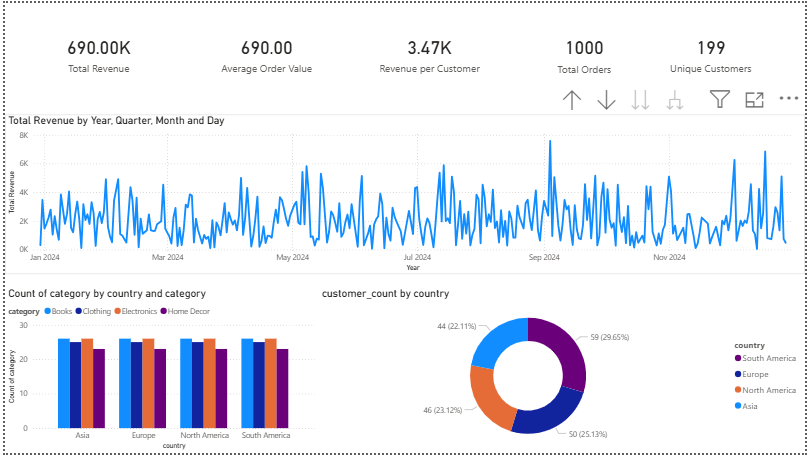

# Business Performance Dashboard – Ecommerce Analysis

## Project Overview
This project analyzes business performance data for an ecommerce mart, with a focus on revenue trends, country-level performance, customer value, and product category insights.

The objective of this project is to demonstrate how **PostgreSQL (SQL)**, **Python**, and **Power BI** can be used together to support **data-driven decision-making** for cross-functional business teams such as Marketing, Supply, and Country Management.


## Key Objectives
- Monitor core business KPIs such as revenue, orders, and customer value  
- Identify seasonal revenue trends  
- Analyze country-level and category-level performance  
- Support customer-centric and performance-driven business insights  


## Tools & Technologies
- **PostgreSQL** – Data storage and analytical SQL queries  
- **Python** – Data auditing and validation  
- **Power BI** – Interactive dashboards and performance reporting  


## Power BI Dashboard Preview

> The dashboard provides an executive-level overview of business performance, including KPIs, revenue trends, country contribution, category performance, and customer distribution.




## Project Structure
```text
business-performance-dashboard/
├── data/
│   └── Raw CSV datasets containing customer, product, and transaction data
├── sql/
│   └── SQL scripts for table creation, data loading, and analytical queries
├── python/
│   └── Python scripts for data auditing, validation, and consistency checks
├── powerbi/
│   └── Power BI dashboard (.pbix) file and dashboard preview image
├── insights/
│   └── Business insights, conclusions, and recommendations
└── README.md
    └── Project documentation and overview


## Key Insights
- Strong overall business performance driven by healthy revenue and order volume  
- Clear seasonality in monthly revenue trends  
- Revenue concentration in top-performing countries  
- High revenue contribution from Books and Electronics categories  
- Strong customer value reflected in revenue per customer  

## Business Value
This project demonstrates how analytical insights can be translated into actionable recommendations for:
- Marketing campaign planning  
- Inventory and supply optimization  
- Country-level performance monitoring  
- Customer-centric strategy development  

## Status
✅ Project setup completed  
✅ Data ingestion and SQL analysis completed  
✅ Power BI dashboard finalized  
